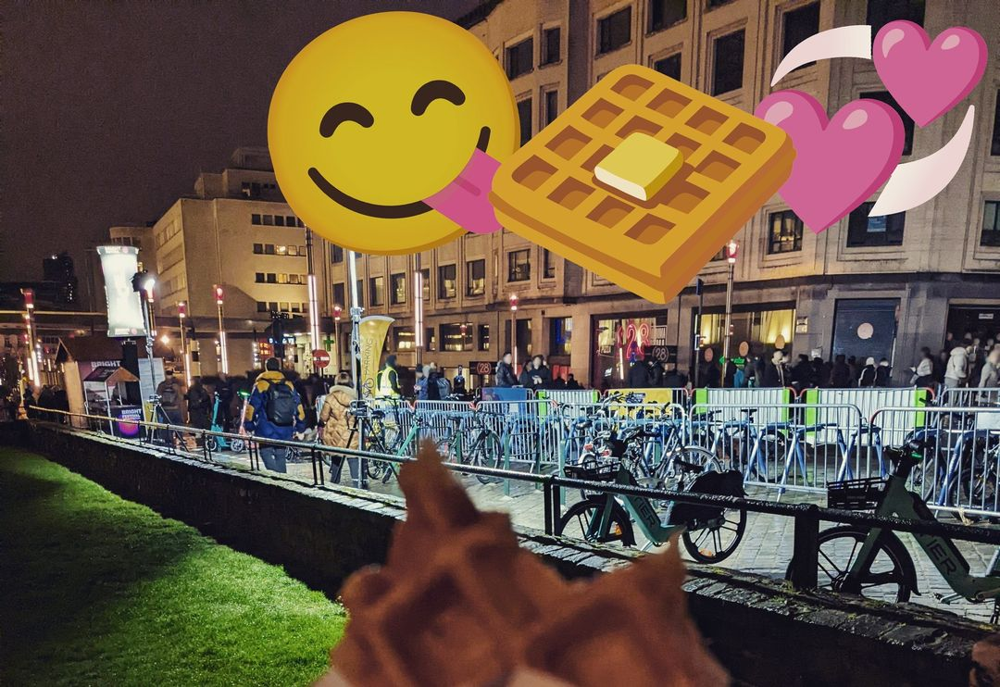

# stalknights_2
Point count: 410pts

Difficulty: medium

Provided files: https://www.instagram.com/p/C7wZW4JPrOz/

Description:
> **starknight1337** shared another photo on their Instagram. What is the name of the park where the photo was taken?

On the left, there are signs reading Bright Festival. This is likely the [Bright Festival in Brussels](https://www.visit.brussels/en/visitors/agenda/bright-festival). We now know that this photo may be taken in Brussels, Belgium. On the right, we see a large 28 sign. This matches the sign of the [Brasserie 28](https://maps.app.goo.gl/3i5AoFKPKbQzZTAx7). We can go into [Google streetview](https://maps.app.goo.gl/KP6Ah7GAhUfEjwcf6) to confirm that this is the same place. The park nearby is called Square de la putterie.

Flag: `jellyCTF{square_de_la_putterie}`

